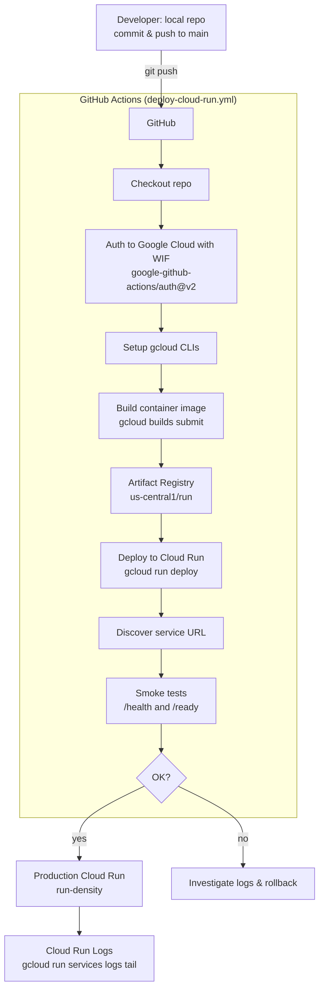

# Deployment Pipeline: run-density → Google Cloud Run

This document summarizes the end‑to‑end flow from a local change to a production deployment on **Google Cloud Run**, plus the key credentials involved.

## High‑level flow



## Components

- **Artifact Registry**: `us-central1 / run`
- **Cloud Run Service**: `run-density` (region: `us-central1`)
- **Workflow file**: `.github/workflows/deploy-cloud-run.yml`

## Required GitHub Action secrets

| Secret | Example | Notes |
|---|---|---|
| `GCP_PROJECT_ID` | `run-density` | GCP project ID |
| `GCP_REGION` | `us-central1` | Must match Cloud Run region |
| `GCP_SERVICE` | `run-density` | Cloud Run service name |
| `GCP_WIF_PROVIDER` | `projects/…/workloadIdentityPools/github-pool/providers/github` | Full provider resource name |
| `GCP_SERVICE_ACCOUNT` | `github-deployer@run-density.iam.gserviceaccount.com` | SA with deploy permissions |

## Required IAM for the GitHub Service Account

Grant these roles on the project (least‑privilege for this pipeline):

- `roles/run.admin` (deploy Cloud Run)
- `roles/iam.serviceAccountUser` (impersonate runtime SAs during deploy)
- `roles/artifactregistry.writer` (push images to Artifact Registry)
- `roles/cloudbuild.builds.editor` (submit Cloud Build)

> Tip: You can consolidate into a custom role later. Avoid using Owner/Editor in production.

## Useful commands

### Tail logs
```bash
gcloud beta run services logs tail run-density --region us-central1
```

### Describe service URL
```bash
gcloud run services describe run-density   --region us-central1 --format='value(status.url)'
```

### Local smoke tests (prod)
```bash
BASE="https://run-density-ln4r3sfkha-uc.a.run.app"
curl -fsS "$BASE/health" | jq .
curl -fsS "$BASE/ready"  | jq .
```

## Troubleshooting quick hits

- **403 on `gcloud builds submit` in CI**  
  Ensure the GitHub service account has `roles/cloudbuild.builds.editor` **and** `roles/artifactregistry.writer` and the workflow is authenticated with WIF.

- **Auth step fails with 404 generateAccessToken**  
  Verify `GCP_SERVICE_ACCOUNT` is a *full email* and `GCP_WIF_PROVIDER` is the *full resource name* (projects/…/providers/…).

- **Container fails to start (startup probe)**  
  Confirm your app listens on `$PORT` (Cloud Run sets `PORT=8080`) and your Dockerfile exposes/cmd uses it.
