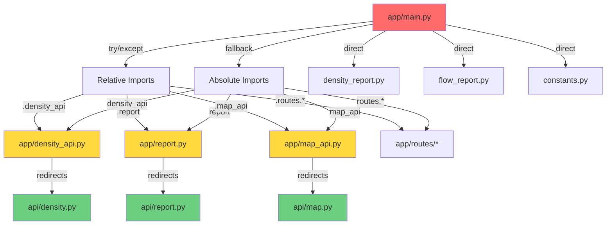

# Current Import Dependencies - v1.6.52

**Generated:** 2025-11-01  
**Purpose:** Map all import patterns to support v1.7.0 architecture reset  
**Status:** Raw audit - needs transformation to visual dependency graph

---

## Table of Contents
1. [Critical Finding: Dual Import Paths](#critical-finding-dual-import-paths)
2. [Architecture Layers](#architecture-layers)
3. [Visual Dependency Graph](#visual-dependency-graph)
4. [Module Import Contract](#module-import-contract)
5. [Complete Import Map](#complete-import-map-from-mainpy)
6. [Safe vs Unsafe Archival](#files-actually-deprecated-safe-to-archive)
7. [Recommendations](#recommendations-for-v170)

---

## Critical Finding: Dual Import Paths

**Every module in `app/main.py` uses BOTH import patterns:**

### Pattern Discovery

```python
# app/main.py lines 16-56
try:
    # RELATIVE IMPORTS (local development preferred)
    from .density import analyze_density_segments
    from .density_api import router as density_router
    from .report import generate_combined_report
    from .map_api import router as map_router
    # ... etc
except ImportError:
    # ABSOLUTE FALLBACK IMPORTS (Cloud Run uses these)
    from density import analyze_density_segments
    from density_api import router as density_router
    from report import generate_combined_report
    from map_api import router as map_router
    # ... etc
```

---

## Complete Import Map from main.py

### Stub Files (Critical for Cloud Run)

**These appear unused in grep but are REQUIRED by fallback imports:**

| File | Relative Import | Absolute Fallback | Purpose |
|------|----------------|-------------------|---------|
| `app/density.py` | `.density` | `density` | Density analysis stub |
| `app/density_api.py` | `.density_api` | `density_api` | Density API router stub |
| `app/flow.py` | `.flow` | `flow` | Flow analysis stub |
| `app/report.py` | `.report` | `report` | Combined report stub |
| `app/map_api.py` | `.map_api` | `map_api` | Map API router stub |
| `app/gpx_processor.py` | `.gpx_processor` | `gpx_processor` | GPX processing stub |

**Status:** ⚠️ **CANNOT be archived** - Required by Cloud Run import fallbacks

---

## Architecture Layers

### Current Layer Structure (v1.6.52)

```
┌─────────────────────────────────────────────────┐
│  ENTRYPOINT: app/main.py                        │
│  - FastAPI application                          │
│  - Dual import pattern (try/except fallbacks)   │
└─────────────────────────────────────────────────┘
                     ↓
┌─────────────────────────────────────────────────┐
│  LAYER 1: API Routes (HTTP Interface)           │
│  - routes/api_*.py (11 routers)                 │
│  - routes/reports.py, routes/ui.py              │
└─────────────────────────────────────────────────┘
                     ↓
┌─────────────────────────────────────────────────┐
│  LAYER 2: Stub Redirects (Compatibility)        │
│  - density_api.py → api/density.py              │
│  - map_api.py → api/map.py                      │
│  - report.py → api/report.py                    │
│  ⚠️ Required by fallback imports                │
└─────────────────────────────────────────────────┘
                     ↓
┌─────────────────────────────────────────────────┐
│  LAYER 3: Business Logic (Core Domain)          │
│  - density_report.py (report generation)        │
│  - flow_report.py (flow analysis)               │
│  - core/* (domain logic)                        │
└─────────────────────────────────────────────────┘
                     ↓
┌─────────────────────────────────────────────────┐
│  LAYER 4: Utilities & Configuration             │
│  - constants.py (system constants)              │
│  - util_env.py (environment helpers)            │
└─────────────────────────────────────────────────┘
```

### Problems with Current Structure

1. **Layers are not enforced** - any module can import from any other
2. **Stub layer shouldn't exist** - architectural smell
3. **Circular dependencies possible** - no import guards
4. **Environment-dependent behavior** - different paths in prod vs local

---

## Visual Dependency Graph

### Main Entry Point Dependencies



**Legend:**
- 🔴 Red: Entry point (main.py)
- 🟡 Yellow: Stub files (should be removed in v1.7)
- 🟢 Green: Actual implementation files
- Gray: Direct imports (no stubs)

---

## Module Import Contract

### Proposed v1.7.0 Import Rules

**Allowed Import Patterns:**

```python
# ✅ ALLOWED: Absolute imports with package prefix
from app.api.density import router
from app.core.flow.flow import analyze_temporal_flow
from app.utils.constants import DEFAULT_STEP_KM

# ✅ ALLOWED: Standard library and third-party
from typing import Dict, List
from fastapi import FastAPI

# ❌ FORBIDDEN: Relative imports in entry points
from .density_api import router

# ❌ FORBIDDEN: Try/except import fallbacks
try:
    from .module import function
except ImportError:
    from module import function

# ❌ FORBIDDEN: Stub files
# No files should exist solely to redirect imports
```

**Layer Import Rules:**

```
API Layer (routes/*)
├─ CAN import from: Core, Utils
└─ CANNOT import from: Other routes (prevents coupling)

Core Layer (core/*)
├─ CAN import from: Utils
└─ CANNOT import from: API, Routes (domain isolation)

Utils Layer (utils/*, constants.py)
├─ CAN import from: Standard library only
└─ CANNOT import from: API, Core, Routes (no dependencies)
```

**Enforcement:**
- Add pre-commit hook to validate import patterns
- CI test to detect try/except import blocks
- Architecture tests to enforce layer boundaries

---

### Active Module Imports

| Module | Type | Fallback Exists | Notes |
|--------|------|-----------------|-------|
| `density_report` | Direct | Yes | Report generation |
| `flow_report` | Direct | Yes | Flow report generation |
| `constants` | Direct | Yes | System constants |
| `util_env` | Direct | Yes | Environment utilities |

---

### Router Imports

All routers use the dual import pattern:

```python
try:
    from .routes.api_density import router as api_density_router
except ImportError:
    from routes.api_density import router as api_density_router
```

**Routers Mapped:**
- `routes.reports`
- `routes.ui`
- `routes.api_segments`
- `routes.api_dashboard`
- `routes.api_health`
- `routes.api_density`
- `routes.api_flow`
- `routes.api_reports`
- `routes.api_bins`
- `routes.api_e2e`
- `routes.api_heatmaps`

---

## Files Actually Deprecated (Safe to Archive)

**These have explicit deprecation warnings and no imports:**

1. **`new_density_report.py`** (279 lines)
   - Warning: "This module is marked as deprecated"
   - Replacement: `density_report.py`
   - Imports Found: None ✅

2. **`new_flagging.py`** (436 lines)
   - Warning: Has deprecation warning
   - Replacement: Logic in `density_template_engine.py`
   - Imports Found: None ✅

3. **`new_density_template_engine.py`** (551 lines)
   - Warning: Has deprecation warning
   - Replacement: `density_template_engine.py`
   - Imports Found: None ✅

4. **`storage.py`** (466 lines)
   - Replacement: `storage_service.py` (19 imports found)
   - Imports Found: None ✅

5. **`conversion_audit.py`** (231 lines)
   - Old audit utility
   - Imports Found: None ✅

**Total Safe to Archive:** 5 files, ~2,000 lines

---

## Files INCORRECTLY Identified as Unused

**November 2025 archival attempt included these (BROKE Docker):**

1. **`density_api.py`** ❌ Required by fallback import
2. **`report.py`** ❌ Required by fallback import
3. **`map_api.py`** ❌ Required by fallback import
4. **`gpx_processor.py`** ❌ Required by fallback import

**Why grep missed them:**
- Search: `from app.density_api import`
- Actual: `from density_api import` (no `app.` prefix)
- Result: False negative

---

## Import Pattern Analysis

### Local Development (venv/Docker)
```python
# Uses relative imports successfully
from .density_api import router
```

### Cloud Run Production
```python
# ImportError on relative imports, falls back to:
from density_api import router
```

### Problem
**Different code paths execute in different environments** → behavior divergence risk

---

## Dependency Graph

```
app/main.py
├── STUBS (required by Cloud Run fallbacks)
│   ├── density.py → core/density/compute.py
│   ├── density_api.py → api/density.py
│   ├── flow.py → core/flow/flow.py
│   ├── report.py → api/report.py
│   ├── map_api.py → api/map.py
│   └── gpx_processor.py → core/gpx/processor.py
│
├── DIRECT IMPORTS
│   ├── density_report.py (active)
│   ├── flow_report.py (active)
│   ├── constants.py (active)
│   └── util_env.py (active)
│
├── ROUTERS
│   ├── routes/api_density.py
│   ├── routes/api_flow.py
│   ├── routes/api_reports.py
│   ├── routes/api_dashboard.py
│   ├── routes/api_segments.py
│   ├── routes/api_bins.py
│   ├── routes/api_e2e.py
│   ├── routes/api_heatmaps.py
│   ├── routes/api_health.py
│   ├── routes/reports.py
│   └── routes/ui.py
│
└── DEPRECATED (safe to remove)
    ├── new_density_report.py
    ├── new_flagging.py
    ├── new_density_template_engine.py
    ├── storage.py
    └── conversion_audit.py
```

---

## Test Coverage Gaps

**Missing Tests:**
1. ❌ Import path validation
2. ❌ Cloud Run import behavior
3. ❌ Module boundary enforcement
4. ❌ Dependency cycle detection

**Current E2E Tests:**
- ✅ API endpoints work
- ✅ Reports generate
- ❌ Don't validate import paths
- ❌ Don't catch import failures before runtime

---

## Recommendations for v1.7.0

### 1. Choose Single Import Pattern

**Option A: Relative imports only**
```python
from .density_api import router
from .routes.api_density import router as api_density_router
```

**Option B: Absolute imports with package prefix**
```python
from app.density_api import router
from app.routes.api_density import router as api_density_router
```

**Recommendation:** Option B
- Standard Python pattern
- Works in all environments
- Clear module provenance
- No try/except hacks needed

### 2. Remove All try/except Import Patterns

**Current (BAD):**
```python
try:
    from .module import function
except ImportError:
    from module import function
```

**v1.7.0 (GOOD):**
```python
from app.module import function
```

### 3. Eliminate Stub Files

**Current Structure:**
```
app/density_api.py (stub) → api/density.py (actual)
```

**v1.7.0 Structure:**
```python
# In main.py:
from app.api.density import router as density_router
```

No stubs needed - direct imports only.

### 4. Add Import Validation Tests

```python
def test_no_import_fallbacks():
    """Ensure no try/except import patterns exist"""
    with open('app/main.py') as f:
        content = f.read()
    assert 'except ImportError:' not in content
```

---

## Migration Strategy

### Phase 1: Audit Complete ✅
- This document maps all imports
- Identified safe vs unsafe archival targets

### Phase 2: Create Test Suite
- Import validation tests
- Module boundary tests
- Dependency cycle detection

### Phase 3: Refactor Incrementally
- Convert one router at a time
- Test after each change
- Keep v1.6.52 as fallback

### Phase 4: Remove Stubs
- After all imports converted
- Verify Cloud Run deployment
- Archive safely

---

## Files Referenced

- `app/main.py` (lines 16-56) - Dual import pattern
- `app/density_api.py` - Stub file
- `app/report.py` - Stub file
- `app/map_api.py` - Stub file
- `app/gpx_processor.py` - Stub file
- `docs/architecture/v1.7-reset-rationale.md` - Planning doc

---

**Next Step:** Create architecture planning branch `refactor/v1.7-architecture`

